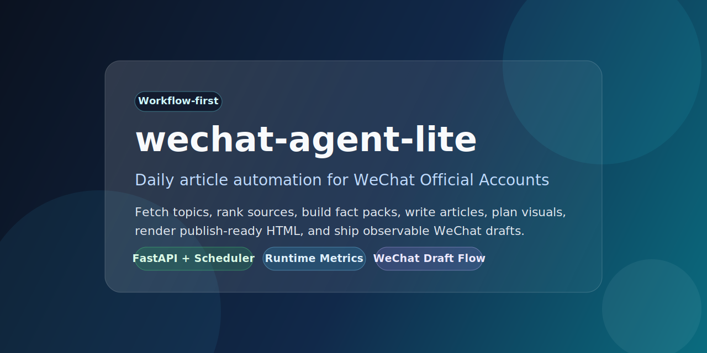

# wechat-agent-lite

**语言：** [English](README.md) | **简体中文**




> 面向微信公众号的工作流优先型文章自动化系统。

`wechat-agent-lite` 是一个偏生产运行的内容自动化应用，目标是在小规格服务器上稳定完成整条日更链路：抓取选题、排序筛选、补充来源材料、生成文章、规划配图、渲染可发布 HTML、创建微信草稿，并通过控制台保留整个流程的可观测性。

## 项目概览

这个仓库不是单纯的 prompt 集合，也不是几个 shell 脚本的拼装，而是一个围绕“可重复发布工作流”构建的小型应用，包含：

- 定时健康检查与主任务运行
- 抓取源维护与修复
- 带结构化中间状态的文章生成
- 标题、配图与渲染阶段
- 草稿发布与日报输出
- token、延迟与存储指标可视化

核心目标很简单：**把 AI 辅助发稿做成可检查、可恢复、可部署的流程**。

## 仓库包含什么

| 区域 | 本仓库提供的内容 |
| --- | --- |
| Runtime 应用 | FastAPI 应用、调度器、持久化、指标与控制台 |
| 生成链路 | 选题采集、排序筛选、事实准备、正文生成、标题与视觉规划 |
| 发布能力 | 微信草稿创建与运行日报输出 |
| 部署资源 | 启动脚本、systemd 模板、打包辅助脚本 |
| 测试 | 覆盖核心运行时与服务层的单测和集成测试 |
| 文档 | 公开版快速开始、配置、架构、部署与开发说明 |

## 核心能力

| 模块 | 作用 |
| --- | --- |
| 选题采集 | 从 RSS、GitHub 和 HTML 列表页采集候选内容 |
| 抓取源维护 | 跟踪来源健康状态、探测 fallback 路径并记录修复动作 |
| 排序筛选 | 结合规则打分与模型重排，为每轮主任务选择一个主题 |
| 事实链路 | 构建 fact pack、压缩证据、为写作准备结构化输入 |
| 写作链路 | 生成正文、标题并执行质量检查 |
| 视觉链路 | 规划正文配图、封面提示词和渲染安全的视觉资产 |
| 发布链路 | 创建微信公众号草稿，必要时保留局部成功状态 |
| 控制台与指标 | 展示运行记录、步骤、token、存储和维护进度 |

## 适合谁使用

- 需要稳定跑每日或高频微信公众号内容流程的个人或小团队
- 想要参考内容自动化系统架构的开发者
- 需要可观测运行、可恢复失败和草稿先行发布机制的团队

## 设计原则

- **工作流优先**：模型调用嵌入受控运行时，而不是散落在临时脚本里
- **适合小服务器部署**：默认关注低资源运行和 token / 存储可视化
- **默认可观测**：运行、步骤和主要成本都能从控制台检查
- **先出草稿再发布**：优先支持安全的草稿生成、人工复核和分阶段放出
- **公开版安全打包**：这个公开仓库不包含私有环境状态和部署秘密

## 架构概览

当前运行时以图式工作流和运维控制台为核心。

```text
抓取来源
  -> 排序并选择主题
  -> 补充来源信息
  -> 构建 Fact Pack
  -> 写正文
  -> 生成标题
  -> 规划配图
  -> 渲染 HTML
  -> 发布草稿
  -> 记录指标与日报
```

主要目录：

- `app/graphs/` - 文章生成图与执行节点
- `app/runtime/` - 运行状态、持久化、投影视图与 graph runner
- `app/agents/` - classify、plan、write、title、evaluate、publish 等 agent
- `app/services/` - 抓取、事实处理、标题生成、视觉、计价、设置与微信发布
- `app/templates/` - 控制台页面
- `config/` - 默认布局、来源和写作模板

详情见：[docs/architecture.md](docs/architecture.md)

## 快速开始

### 1. 克隆仓库并创建虚拟环境

```bash
git clone https://github.com/<your-account>/wechat-agent-lite-public.git
cd wechat-agent-lite-public
python -m venv .venv
```

Windows PowerShell：

```powershell
.\.venv\Scripts\activate
pip install -r requirements.txt
```

macOS / Linux：

```bash
source .venv/bin/activate
pip install -r requirements.txt
```

### 2. 准备环境变量

复制 `.env.example`，或在 shell 中导出所需环境变量。仓库中**不会**包含任何真实凭据。

本地最小配置：

- `WAL_TIMEZONE`
- `WAL_DATA_DIR`
- `WAL_DB_PATH`
- `WAL_ENCRYPTION_KEY`

LLM 密钥、微信公众号凭据、SMTP 和可选搜索提供方等内容通过运行时设置层配置。

详情见：[docs/configuration.md](docs/configuration.md)

### 3. 运行应用

```bash
python run.py
```

默认本地控制台地址：

- `http://127.0.0.1:8080`

## 仓库结构

```text
wechat-agent-lite-public/
├── app/
├── assets/
├── config/
├── deploy/
├── docs/
├── tests/
├── .env.example
├── .gitignore
├── README.md
├── README.zh-CN.md
├── requirements.txt
└── run.py
```

## 文档索引

- [快速开始](docs/getting-started.md)
- [配置说明](docs/configuration.md)
- [架构说明](docs/architecture.md)
- [部署说明](docs/deployment.md)
- [开发说明](docs/development.md)

## 隐私与安全说明

这个公开版故意排除了以下内容：

- 个人或服务器专属 IP
- 私有部署路径与 release 目录
- API key、token、secret、应用凭据和 SMTP 密码
- 运行数据库、日志、缓存输出和临时产物
- 内部验收报告与运维快照

如果你要公开自己的 fork，也建议遵守同一条原则：**提交代码与模板，不提交正在使用的环境状态**。

## 当前状态

- 已具备控制台、调度、指标与发布等完整运行链路
- 当前仓库已整理为适合公开发布的干净版本
- 既适合作为私有部署基础，也适合作为公开实验基线

## 后续方向

- 继续降低扩写时的幻觉风险
- 在不依赖正文 H1 的前提下提升标题质量
- 让正文配图更贴近来源语义并保持渲染安全
- 在保持低资源可部署性的前提下继续提升文章质量
